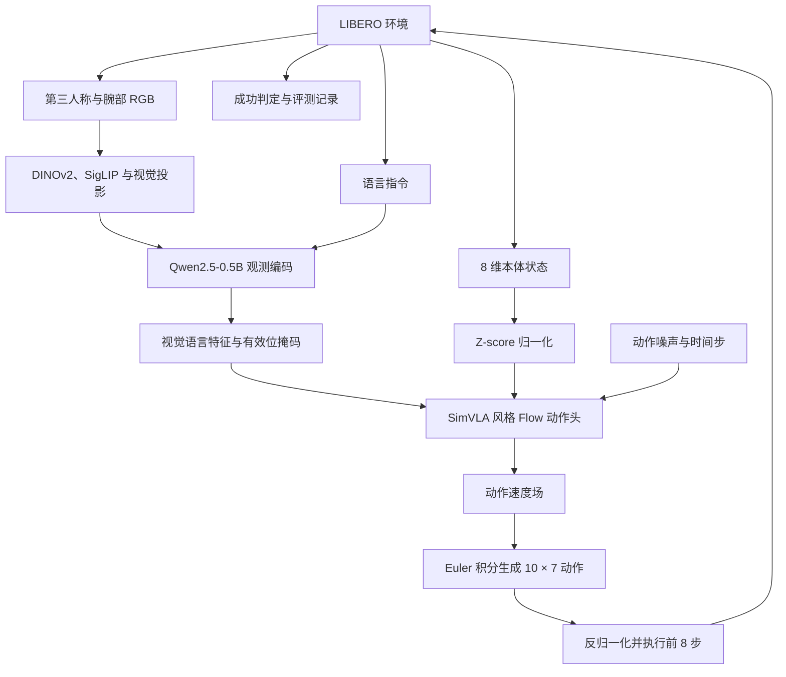

# VLA-Sim-Adapter

<div align="center">

**Prismatic 视觉语言主干 × SimVLA 风格 Flow Matching 动作头**

自主训练 · 连续动作生成 · LIBERO 闭环评估 · 分布式训练与评测

**LIBERO-Spatial：487 / 500 · 97.4% 成功率 · 120,000-step checkpoint**

[项目介绍](#项目介绍) · [系统架构](#系统架构) · [训练方法](#训练方法) · [实验结果](#实验结果) · [快速开始](#快速开始)

</div>

---

## 项目介绍

我围绕视觉—语言—动作模型在 LIBERO 仿真中的训练与部署开展实验：首先复现 VLA-Adapter 官方模型，建立评测基线；随后构建 **Prismatic-SimVLA Hybrid 模型**，将 Prismatic 的视觉语言观测编码器与 SimVLA 风格的连续动作 Flow Matching 头连接，完成模型训练与闭环评估。

在 **120,000-step checkpoint** 上，我对 LIBERO-Spatial 的全部 10 个任务进行评测，每个任务使用 50 个官方初始状态，共执行 500 条测试轨迹，成功完成 **487 条**，整体任务成功率为 **97.4%**。

模型以第三人称图像、腕部图像、语言指令和本体状态为条件，在归一化动作空间中学习速度场，通过 Euler 积分生成未来动作序列，再执行部分动作并重新观测。项目包含 RLDS 数据接入、DDP 联合训练、完整训练状态恢复和可断点续跑的多 GPU 仿真评测。

### 分支导航

| 分支 | 内容 |
| --- | --- |
| [research/prismatic-simvla](https://github.com/chenfeiyi076-boop/vla-sim-adapter/tree/research/prismatic-simvla) | **Hybrid 模型、自主训练与自训练模型评测** |
| [repro/spatial-pro-eval](https://github.com/chenfeiyi076-boop/vla-sim-adapter/tree/repro/spatial-pro-eval) | 官方 Spatial-Pro 权重复现与环境记录 |

我将 Hybrid 模型的实现、训练与评测代码维护在研究分支，将官方模型复现记录保留在复现分支。下文的 Hybrid 命令均在 `research/prismatic-simvla` 分支执行。

## 我的工作

- **构建 Hybrid VLA 模型**：新增仅编码观测的 `encode_observation()` 接口，提取视觉语言特征与 padding mask，接入 concat Transformer Flow 动作头。
- **自主训练连续动作模型**：以 10 步、每步 7 维动作序列为监督，联合优化实际参与观测编码的主干参数与 Flow 动作头。
- **统一数据和控制约定**：接入双视角图像、任务语言和本体状态，对动作和本体状态进行 Z-score 归一化，推理后转换为模拟器控制输入。
- **实现分布式训练与恢复**：支持单卡或四卡 DDP、RLDS 数据源分片、独立主干/动作头学习率，以及模型和 AdamW 状态恢复。
- **评估自训练 checkpoint**：校验权重步数、任务集与归一化统计，输出逐任务成功率、策略调用数和动作执行步数。
- **实现并行评测与续跑**：独立 Worker 分配任务，逐 Episode 保存结果，校验实验身份后恢复未完成试验。

## 系统架构



观测编码器使用图像和任务语言，返回 Qwen decoder 的最后一层特征。该接口保留梯度，不生成词表 logits，也不将监督动作作为语言输入。

我将加噪动作、本体状态与时间嵌入编码为动作 token，与投影后的视觉语言 token 拼接，再通过非因果 Transformer 预测速度场。推理每次生成 **10 步动作**，闭环执行 **前 8 步**后重新规划。

| 模块 | 实现 |
| --- | --- |
| 观测编码接口 | [modeling_prismatic.py](https://github.com/chenfeiyi076-boop/vla-sim-adapter/blob/research/prismatic-simvla/prismatic/extern/hf/modeling_prismatic.py) |
| Flow 动作头与训练目标 | [flow_action_head.py](https://github.com/chenfeiyi076-boop/vla-sim-adapter/blob/research/prismatic-simvla/prismatic/models/flow_action_head.py) |
| Euler 动作采样 | [flow_sampling.py](https://github.com/chenfeiyi076-boop/vla-sim-adapter/blob/research/prismatic-simvla/prismatic/models/flow_sampling.py) |
| RLDS 数据桥接 | [hybrid_datasets.py](https://github.com/chenfeiyi076-boop/vla-sim-adapter/blob/research/prismatic-simvla/prismatic/vla/datasets/hybrid_datasets.py) |
| 动作与本体状态归一化 | [hybrid_normalization.py](https://github.com/chenfeiyi076-boop/vla-sim-adapter/blob/research/prismatic-simvla/prismatic/vla/hybrid_normalization.py) |
| 参数选择与损失计算 | [hybrid_step.py](https://github.com/chenfeiyi076-boop/vla-sim-adapter/blob/research/prismatic-simvla/prismatic/training/hybrid_step.py) |
| 自训练模型策略桥接 | [hybrid_policy.py](https://github.com/chenfeiyi076-boop/vla-sim-adapter/blob/research/prismatic-simvla/experiments/robot/libero/hybrid_policy.py) |

## 数据流程

我使用公开的 [LIBERO RLDS 演示数据](https://huggingface.co/datasets/openvla/modified_libero_rlds)，主要训练任务集为 `libero_spatial_no_noops`。

1. **读取演示轨迹**：获取双视角图像、任务语言、8 维本体状态和 7 维连续动作。
2. **构建动作窗口**：时刻 `i` 的观测对应 `actions[i:i+10]`，生成未来 10 步监督。
3. **处理观测输入**：两路图像处理为 224px 输入，使用仅包含任务观测的 Qwen prompt，并构建有效 token 掩码。
4. **归一化数值**：使用匹配数据集的全局均值和标准差归一化动作与本体状态；checkpoint 保存同一份统计量。
5. **分布式数据分片**：在 repeat、窗口化和 shuffle 前按 rank/world size 划分 RLDS 数据源。
6. **执行训练**：计算动作空间 Flow Matching 损失，更新编码器和动作头，记录损失、梯度与显存信息。

我基于公开演示数据完成训练样本构建、数值归一化、分布式数据接入与仿真控制对齐。

## 训练方法

### 动作空间 Flow Matching

我在归一化动作空间中训练速度场。对真实动作序列 $a$ 和高斯噪声 $\epsilon$，构造：

```math
x_t=(1-t)a+t\epsilon, \qquad v^*=\epsilon-a
```

我以 `Beta(1.5, 1.0)` 采样时间，再缩放至 `[0.001, 1]`。模型根据视觉语言特征、本体状态、加噪动作和时间步预测速度场：

```math
\mathcal{L}_{\mathrm{flow}}
=\operatorname{MSE}\left(v_\theta(f_{\mathrm{VLM}},x_t,p,t),\epsilon-a\right)
```

推理从高斯噪声出发，沿时间从 1 到 0 执行 Euler 积分，再反归一化并进入 LIBERO 控制流程。

### 联合训练与恢复

我采用 AdamW 与 BF16 autocast 训练模型，并实现单卡和四卡 NCCL/DDP 训练入口。参数集合覆盖实际参与观测编码的视觉主干、视觉投影、语言嵌入和 Qwen decoder，以及全部 Flow 动作头参数；排除未参与该前向路径的模块。

主干与动作头可使用不同学习率。Checkpoint 保存编码器、动作头、优化器、全局步数、配置和归一化信息，支持严格配置校验后的恢复，以及显式延长最大训练步数。恢复会重建 RLDS 数据流，未保存迭代器和完整随机数状态，因此不保证与不中断训练逐位一致。

### 模型与训练设置

| 项目 | 设置 |
| --- | --- |
| 训练数据 | `libero_spatial_no_noops` |
| 视觉输入 | 第三人称与腕部相机，224px |
| 视觉语言主干 | Prismatic：DINOv2 + SigLIP + Qwen2.5-0.5B |
| 动作生成头 | SimVLA 风格 concat Transformer Flow 头 |
| 动作窗口 / 动作维度 / 状态维度 | 10 / 7 / 8 |
| 训练目标 | 动作速度场 MSE |
| 优化器 / 训练精度 | AdamW / BF16 autocast |
| 学习率设置 | 主干与 Flow 动作头可分别配置 |
| 最终评测 checkpoint | **120,000 step** |

我将运行配置保存为 `run_config.json`，将逐步损失与梯度等训练信息保存为 `train.jsonl`，并在 checkpoint 中保存模型、优化器及训练步数。训练入口和恢复方法见 [训练文档](https://github.com/chenfeiyi076-boop/vla-sim-adapter/blob/research/prismatic-simvla/vla-scripts/HYBRID_SPATIAL_FORMAL.md)。

## 实验结果

### 自训练 Hybrid 模型

我在 LIBERO 仿真环境中评估自训练模型，底层使用 **robosuite–MuJoCo** 完成机器人操作任务仿真。评测覆盖 LIBERO-Spatial 基准中的全部 **10 个空间操作任务**，每个任务基于 **50 个官方初始状态**分别执行 50 条测试轨迹，共计 **500 条测试轨迹**。

在 **120,000-step checkpoint** 上，模型成功完成 **487 条轨迹**，整体任务成功率达到 **97.4%**。

| 评测项目 | 结果与设置 |
| --- | --- |
| 模型 | Prismatic-SimVLA Hybrid |
| 权重 | 自主训练的编码器与 Flow 动作头 |
| Checkpoint | **120,000 step** |
| 评测基准 | LIBERO-Spatial |
| 仿真引擎 | robosuite–MuJoCo |
| 任务数 | 10 |
| 每任务官方初始状态数 / 测试轨迹数 | 50 / 50 |
| 总测试轨迹数 | 500 |
| 成功轨迹数 | **487** |
| 整体任务成功率 | **97.4%** |

```math
\mathrm{Success\ Rate}=\frac{487}{500}\times100\%=97.4\%
```

### 官方模型复现基线

我同时评估了官方发布的 VLA-Adapter Spatial-Pro 权重，作为自主训练实验的参照。

| 模型 | 权重来源 | 评测规模 | 成功率 |
| --- | --- | --- | --- |
| **Prismatic-SimVLA Hybrid** | **自主训练，120,000-step checkpoint** | **10 任务 × 50 条轨迹** | **487/500，97.4%** |
| VLA-Adapter Spatial-Pro | 官方发布权重，本地复现 | 10 任务 × 50 条轨迹 | 493/500，98.6% |

我的 Hybrid 模型在本次评测中的成功率比官方模型本地复现基线低 **1.2 个百分点**。我将两种模型的结果分别记录，区分自主训练模型与官方发布权重。

官方模型复现的环境与逐任务记录见 [2026-09-12 实验记录](experiment_records/2026-09-12_spatial_pro_official50/README.md)。

## 硬件与环境

我在四张 A100 的服务器上完成官方模型复现，并实现四卡 CUDA 训练和独立进程评测管线。以下为复现基线使用的环境配置。

| 组件 | 基线实验环境 |
| --- | --- |
| GPU | 4 × NVIDIA A100-PCIE-40GB |
| 系统 / Python | Linux x86_64 / 3.10.16 |
| PyTorch / CUDA runtime | 2.2.0+cu118 / 11.8 |
| Transformers / Flash Attention | 4.40.1 / 2.5.5 |
| robosuite / MuJoCo | 1.4.1 / 2.3.7 |
| NumPy | 1.26.4 |

我将基线环境快照保存于 `experiment_records/2026-09-12_spatial_pro_official50/`，训练入口通过运行配置与日志记录模型训练参数。

## 快速开始

### 1. 获取研究分支与安装依赖

```bash
git clone --branch research/prismatic-simvla \
  https://github.com/chenfeiyi076-boop/vla-sim-adapter.git
cd vla-sim-adapter

conda create -n vla-sim python=3.10.16 -y
conda activate vla-sim
pip install torch==2.2.0 torchvision==0.17.0 torchaudio==2.2.0 \
  --index-url https://download.pytorch.org/whl/cu118
pip install -e .
pip install "numpy==1.26.4" packaging ninja
pip install "flash-attn==2.5.5" --no-build-isolation

git clone https://github.com/Lifelong-Robot-Learning/LIBERO.git
pip install -e ./LIBERO
pip install -r experiments/robot/libero/libero_requirements.txt
pip install "mujoco==2.3.7" "numpy==1.26.4"
export PYTHONPATH="$PWD"
```

Flash Attention 编译需匹配的 CUDA Toolkit。按 [LIBERO 说明](https://github.com/Lifelong-Robot-Learning/LIBERO) 配置场景资产和初始状态，并核对 EGL 渲染环境。

### 2. 准备 VLM 与 RLDS 数据

下载 [Prismatic VLM](https://huggingface.co/Stanford-ILIAD/prism-qwen25-extra-dinosiglip-224px-0_5b)，保留仓库已有的 `pretrained_models/configs/`：

```bash
python - <<'PY'
from huggingface_hub import snapshot_download
snapshot_download(
    repo_id="Stanford-ILIAD/prism-qwen25-extra-dinosiglip-224px-0_5b",
    local_dir="pretrained_models/prism-qwen25-extra-dinosiglip-224px-0_5b",
)
PY
```

RLDS 数据放在 `data/libero/libero_spatial_no_noops/1.0.0/`。评测需要与 checkpoint 匹配的原始 RLDS `dataset_statistics.json`，下文用 `STATS` 指定实际路径。

### 3. 自主训练 Hybrid 模型

下面提供四卡训练命令示例，使用 40,000 步和统一学习率配置展示训练入口。前文报告的 **97.4%** 来自 **120,000-step checkpoint**，并非此示例的输出成绩。

```bash
CUDA_VISIBLE_DEVICES=0,1,2,3 \
torchrun --standalone --nnodes=1 --nproc_per_node=4 \
  vla-scripts/train_hybrid_spatial.py \
  --vlm-path pretrained_models/prism-qwen25-extra-dinosiglip-224px-0_5b \
  --hf-config pretrained_models/configs \
  --data-root data/libero \
  --dataset-key libero_spatial_no_noops \
  --run-dir runs/hybrid_spatial_40k \
  --per-device-batch-size 1 \
  --max-steps 40000 \
  --learning-rate 1e-6 \
  --lr-decay-step 30000 \
  --lr-decay-factor 0.1 \
  --save-every 10000 \
  --log-every 20 \
  --shuffle-buffer-size 10000 \
  --seed 7
```

我为 Flow 动作头提供独立学习率参数 `--flow-head-learning-rate`。开展差分学习率实验时可设置为 `1e-5` 并使用新的运行目录；短训练与 checkpoint 检查方法见训练文档。

| 训练产物 | 路径 |
| --- | --- |
| 运行配置 | `runs/hybrid_spatial_40k/run_config.json` |
| 训练日志 | `runs/hybrid_spatial_40k/train.jsonl` |
| 示例训练输出 checkpoint | `runs/hybrid_spatial_40k/checkpoints/step-00040000.pt` |

恢复训练使用 `--resume`；如需增加计划训练步数，还需添加 `--allow-max-steps-extension`。其他配置须保持兼容，详见训练文档。

### 4. 评估自训练模型

我使用自训练的 **120,000-step checkpoint** 进行评估。将 `CKPT` 和 `STATS` 修改为实际文件路径后，先运行一个任务、两次试验检查加载与控制链路：

```bash
CKPT=/path/to/step-00120000.pt
STATS=/path/to/dataset_statistics.json

CUDA_VISIBLE_DEVICES=0 MUJOCO_GL=egl MUJOCO_EGL_DEVICE_ID=0 \
python -m experiments.robot.libero.run_hybrid_eval \
  --checkpoint "$CKPT" \
  --vlm-path pretrained_models/prism-qwen25-extra-dinosiglip-224px-0_5b \
  --hf-config pretrained_models/configs \
  --statistics "$STATS" \
  --task-suite libero_spatial \
  --expected-step 120000 \
  --num-steps 10 \
  --task-id 0 \
  --trials-per-task 2 \
  --output eval_results/hybrid_spatial_smoke.json
```

完整单卡评测删除 `--task-id 0`，将 `--trials-per-task` 改为 `50`，即可覆盖全部 10 个任务与 500 条轨迹。更换 checkpoint 时同步修改 `--expected-step`、匹配统计文件与输出路径。

### 5. 四卡并行评测与恢复

确认 Worker 的 GPU 与 EGL 配置后执行：

```bash
CKPT=/path/to/step-00120000.pt
STATS=/path/to/dataset_statistics.json

python -m experiments.robot.libero.run_hybrid_eval_parallel \
  --num-workers 4 \
  --devices 0 1 2 3 \
  --checkpoint "$CKPT" \
  --vlm-path pretrained_models/prism-qwen25-extra-dinosiglip-224px-0_5b \
  --hf-config pretrained_models/configs \
  --statistics "$STATS" \
  --task-suite libero_spatial \
  --expected-step 120000 \
  --num-steps 10 \
  --trials-per-task 50 \
  --seed 7 \
  --run-dir eval_results/hybrid_spatial_parallel \
  --output eval_results/hybrid_spatial_parallel.json
```

训练使用 DDP；评测使用独立进程。每个 Worker 持有一个模型和环境，父进程合并结果。我在 launcher 中隔离物理 GPU，为 Worker 设置本地 `cuda:0`、EGL 设备 0，并禁用 TensorFlow GPU，以分离模型推理和模拟器渲染的资源配置。

中断后用相同参数添加 `--resume`，从已保存的 Episode 记录继续；最终输出存在时不会覆盖。详见 [并行评测文档](https://github.com/chenfeiyi076-boop/vla-sim-adapter/blob/research/prismatic-simvla/experiments/robot/libero/HYBRID_PARALLEL_EVAL.md)。

## 评测输出

我将 Hybrid 评测结果保存为最终 JSON 和逐 Episode partial 记录，包含任务与试验编号、成功判定、策略调用数和动作执行步数，并支持调试动作轨迹与耗时统计。

官方 VLA-Adapter 评测入口还支持保存 rollout 视频。

## 项目结构

| 路径 | 用途 |
| --- | --- |
| `prismatic/models/flow_action_head.py` | 新增 Flow 动作头与训练目标 |
| `prismatic/models/flow_sampling.py` | Euler 动作采样 |
| `prismatic/vla/datasets/hybrid_datasets.py` | Hybrid RLDS 数据接入 |
| `prismatic/training/hybrid_*.py` | 联合训练、DDP 与 checkpoint 管线 |
| `vla-scripts/train_hybrid_spatial.py` | 自主训练入口 |
| `experiments/robot/libero/hybrid_policy.py` | Hybrid 观测到动作桥接 |
| `experiments/robot/libero/run_hybrid_eval.py` | 自训练模型串行评测 |
| `experiments/robot/libero/run_hybrid_eval_parallel.py` | 并行评测与续跑 |
| `experiments/robot/libero/compare_hybrid_eval.py` | 结果与调试轨迹对照 |
| `tests/test_hybrid_*.py`、`tests/test_flow_*.py` | 新增模型、训练与评测测试 |
| `experiment_records/` | 官方模型复现的环境与结果记录 |

## 来源与许可

我在 [VLA-Adapter](https://github.com/OpenHelix-Team/VLA-Adapter) / Prismatic 基础上扩展模型，参考并改编 [SimVLA](https://github.com/LUOyk1999/SimVLA) 的 Flow 动作头，使用 [LIBERO](https://github.com/Lifelong-Robot-Learning/LIBERO) 进行仿真评测。

本项目沿用 [MIT](LICENSE)；改编的 SimVLA 部分保留 [Apache-2.0 许可说明](https://github.com/chenfeiyi076-boop/vla-sim-adapter/blob/research/prismatic-simvla/third_party/licenses/SimVLA-LICENSE.txt)。我完成了主干与动作头集成、数据与控制对齐、自主训练和闭环评测。

