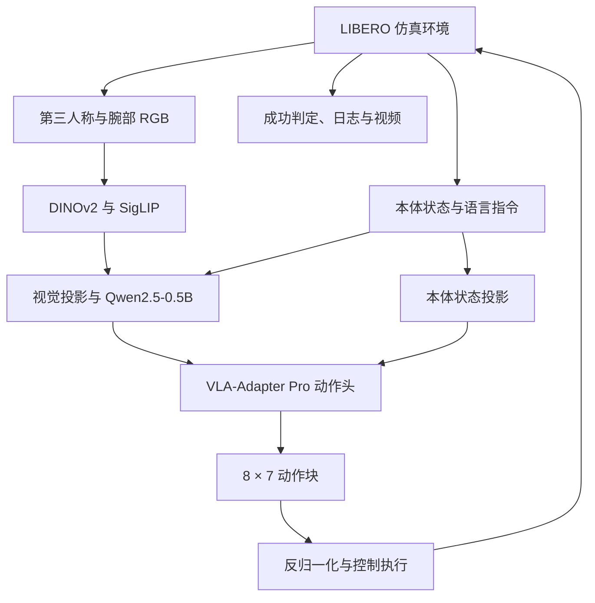

# VLA-Sim-Adapter

<div align="center">

**VLA-Adapter 在 LIBERO 仿真环境中的适配与评测复现**

双视角视觉 · 语言指令 · 本体状态 · 动作块推理 · 多 GPU 评测

**LIBERO-Spatial 本地复现：493 / 500，成功率 98.6%**

[项目介绍](#项目介绍) · [系统架构](#系统架构) · [实验结果](#实验结果) · [快速开始](#快速开始) · [训练方法](#训练方法)

</div>

---

## 项目介绍

本项目基于 [OpenHelix-Team/VLA-Adapter](https://github.com/OpenHelix-Team/VLA-Adapter)，围绕视觉—语言—动作模型在 LIBERO 仿真中的推理、评测和环境适配开展复现。

当前分支使用官方发布的 `LIBERO-Spatial-Pro` 权重，将第三人称图像、腕部图像、机器人本体状态和语言指令接入策略模型，执行动作块并统计任务成功率。项目扩展了任务范围参数，支持按任务划分多 GPU 独立评测，并保留环境快照、代码补丁和实验记录。

> **模型与实验来源**：VLA-Adapter 架构和预训练权重来自上游项目；本仓库已记录的主要工作是仿真评测复现、任务划分与运行环境适配。以下 98.6% 使用官方权重得到，不是本地重新训练模型的成绩。

### 主要工作

- **仿真闭环推理**：从 LIBERO 读取双视角 RGB、本体状态和任务语言，预测动作块并回写模拟器。
- **任务范围扩展**：增加 `task_start` / `task_end`，支持半开区间 `[start, end)` 任务评测。
- **多 GPU 独立评测**：将 10 个任务分配给 4 个进程，每个进程使用独立 GPU、模拟器和输出日志。
- **EGL 环境适配**：记录并修复本次环境中的单卡可见进程与 EGL 设备索引不匹配问题。
- **实验追溯**：保存系统配置、依赖快照、评测入口补丁与逐任务成功数。

## 系统架构



本次评测使用两个图像输入、8 维本体状态以及 L1 回归动作头。模型每次输出 8 个时间步、每步 7 维的连续动作；执行动作块后重新观测环境，直到成功或达到任务步数上限。

| 组件 | 实现 |
| --- | --- |
| LIBERO 环境、任务循环与任务范围 | [run_libero_eval.py](experiments/robot/libero/run_libero_eval.py) |
| 图像处理、模拟器与视频工具 | [libero_utils.py](experiments/robot/libero/libero_utils.py) |
| 模型、动作头和本体状态投影加载 | [openvla_utils.py](experiments/robot/openvla_utils.py) |
| 通用机器人推理工具 | [robot_utils.py](experiments/robot/robot_utils.py) |
| 连续动作预测头 | [action_heads.py](prismatic/models/action_heads.py) |
| 动作维度与动作块常量 | [constants.py](prismatic/vla/constants.py) |

## 实验结果

### LIBERO-Spatial-Pro 本地复现

| 项目 | 配置 |
| --- | --- |
| 实验日期 | 2026-09-12 |
| 任务集 | `libero_spatial` |
| 权重 | 官方 `VLA-Adapter/LIBERO-Spatial-Pro` |
| 任务数 / 每任务试验数 | 10 / 50 |
| 总 Episode 数 | 500 |
| 图像输入数 / 本体状态输入 | 2 / 开启 |
| 动作头 / 开环执行步数 | L1 回归 / 8 |
| 执行方式 | 4 个独立评测进程 |
| 完整记录 | [实验记录](experiment_records/2026-09-12_spatial_pro_official50/README.md) |

| Task ID | 成功数 | 成功率 |
| ---: | ---: | ---: |
| 0 | 50 / 50 | 100% |
| 1 | 50 / 50 | 100% |
| 2 | 50 / 50 | 100% |
| 3 | 50 / 50 | 100% |
| 4 | 48 / 50 | 96% |
| 5 | 49 / 50 | 98% |
| 6 | 48 / 50 | 96% |
| 7 | 50 / 50 | 100% |
| 8 | 48 / 50 | 96% |
| 9 | 50 / 50 | 100% |
| **合计** | **493 / 500** | **98.6%** |

成功率按总成功 Episode 数除以总 Episode 数计算：

```math
\text{Success Rate}=\frac{493}{500}\times100\%=98.6\%
```

| 结果来源 | Spatial-Pro 成功率 | 说明 |
| --- | ---: | --- |
| 本仓库记录的本地复现 | **98.6%** | 10 个任务，每任务 50 次 |
| 上游发布结果 | 99.6% | 上游报告值，参见 [VLA-Adapter](https://github.com/OpenHelix-Team/VLA-Adapter#results) |

本地结果比上游报告值低 **1.0 个百分点**。这里只报告一次已归档实验，不据此归因性能差异或声称达到相同结果。仓库 `eval_logs/` 中的其他基准日志不在本表中作为本地复现成绩汇总。

正式评测前，实验记录还报告了 **10 个任务 × 1 次试验，10/10 成功**的烟雾测试，用于检查环境观测、模型推理、动作执行、成功判定和视频输出链路。

### 多 GPU 任务划分

| Worker | Task ID | 成功数 | 成功率 |
| --- | --- | ---: | ---: |
| GPU 0 | 0、1、2 | 150 / 150 | 100% |
| GPU 1 | 3、4、5 | 147 / 150 | 98% |
| GPU 2 | 6、7 | 98 / 100 | 98% |
| GPU 3 | 8、9 | 98 / 100 | 98% |

每个 Worker 独立运行完整策略推理，按任务分配工作。这不是 DDP，也不是将一个模型拆到多张 GPU 上。

## 硬件与环境

本次工作以仿真评测为主，已归档实验使用以下计算环境：

| 组件 | 实验配置 |
| --- | --- |
| GPU | 4 × NVIDIA A100-PCIE-40GB |
| 系统 | Linux x86_64 |
| Python | 3.10.16 |
| PyTorch | 2.2.0+cu118 |
| CUDA Toolkit / Runtime | 11.8 |
| Transformers | 4.40.1 |
| Flash Attention | 2.5.5 |
| robosuite / MuJoCo | 1.4.1 / 2.3.7 |
| NumPy | 1.26.4 |

四卡用于并行加速评测；下文先给出单卡入口。环境详情见 [system_info.txt](experiment_records/2026-09-12_spatial_pro_official50/system_info.txt)、[pip_freeze.txt](experiment_records/2026-09-12_spatial_pro_official50/pip_freeze.txt) 和 [conda_list.txt](experiment_records/2026-09-12_spatial_pro_official50/conda_list.txt)。

`nvidia-smi` 显示的 CUDA 12.8 是驱动支持版本；本次 Python 环境中的 PyTorch CUDA 构建与 `nvcc` 版本为 11.8。

## 快速开始

以下命令从仓库根目录执行，对应 `repro/spatial-pro-eval` 分支。

### 1. 安装项目

```bash
git clone --branch repro/spatial-pro-eval \
  https://github.com/chenfeiyi076-boop/vla-sim-adapter.git
cd vla-sim-adapter

conda create -n vla-sim python=3.10.16 -y
conda activate vla-sim

pip install torch==2.2.0 torchvision==0.17.0 torchaudio==2.2.0 \
  --index-url https://download.pytorch.org/whl/cu118
pip install -e .
pip install "numpy==1.26.4" packaging ninja

export PYTHONPATH="$PWD"
```

编译 Flash Attention 需要兼容的 CUDA Toolkit 和编译环境：

```bash
pip install "flash-attn==2.5.5" --no-build-isolation
```

[pyproject.toml](pyproject.toml) 定义项目依赖；实验快照保留了实际安装版本。快照中的本地路径和 editable 安装地址属于原实验环境，不宜直接作为通用安装清单。

### 2. 安装 LIBERO

```bash
git clone https://github.com/Lifelong-Robot-Learning/LIBERO.git
pip install -e ./LIBERO
pip install -r experiments/robot/libero/libero_requirements.txt
pip install "mujoco==2.3.7" "numpy==1.26.4"
```

按 [LIBERO 安装说明](https://github.com/Lifelong-Robot-Learning/LIBERO) 完成资源与路径配置，确保能够加载任务、场景资产和默认初始状态。只评估发布权重时无需下载完整训练集。

### 3. 下载官方权重

```bash
python - <<'PY'
from huggingface_hub import snapshot_download

snapshot_download(
    repo_id="VLA-Adapter/LIBERO-Spatial-Pro",
    local_dir="pretrained_models/LIBERO-Spatial-Pro",
)
PY
```

下载完整 checkpoint，包括模型、处理器配置、动作头、本体状态投影和数据归一化统计。仅下载语言模型权重无法运行完整策略。

### 4. 单卡烟雾测试

```bash
mkdir -p eval_logs

CUDA_VISIBLE_DEVICES=0 MUJOCO_GL=egl \
python experiments/robot/libero/run_libero_eval.py \
  --pretrained_checkpoint pretrained_models/LIBERO-Spatial-Pro \
  --task_suite_name libero_spatial \
  --use_l1_regression True \
  --use_minivlm True \
  --use_pro_version True \
  --use_proprio True \
  --num_images_in_input 2 \
  --num_open_loop_steps 8 \
  --num_trials_per_task 1 \
  --task_start 0 \
  --task_end 10 \
  --seed 7 \
  --local_log_dir eval_logs \
  --run_id_note spatial_pro_smoke
```

这是快速连通性检查。正式成功率评测需将 `--num_trials_per_task` 改为 `50`，使用另一个 `run_id_note` 保存结果。

### 5. 四卡独立评测

先确认每个 Worker 的 EGL 渲染与 GPU 可见性正常，再执行：

```bash
mkdir -p eval_logs

for worker in 0 1 2 3; do
  case "$worker" in
    0) start=0; end=3 ;;
    1) start=3; end=6 ;;
    2) start=6; end=8 ;;
    3) start=8; end=10 ;;
  esac

  CUDA_VISIBLE_DEVICES="$worker" MUJOCO_GL=egl \
  python experiments/robot/libero/run_libero_eval.py \
    --pretrained_checkpoint pretrained_models/LIBERO-Spatial-Pro \
    --task_suite_name libero_spatial \
    --use_l1_regression True \
    --use_minivlm True \
    --use_pro_version True \
    --use_proprio True \
    --num_images_in_input 2 \
    --num_open_loop_steps 8 \
    --num_trials_per_task 50 \
    --task_start "$start" \
    --task_end "$end" \
    --seed 7 \
    --local_log_dir eval_logs \
    --run_id_note "spatial_pro_gpu$worker" \
    > "eval_logs/spatial_pro_gpu$worker.stdout.log" 2>&1 &
done

wait
```

所有 Worker 使用不同运行标识区分日志。视频文件名由启动时间、任务描述和 Episode 编号组成；本例各 Worker 的任务互不重叠。汇总时累加各 Worker 成功数与 Episode 数；这里各 Worker 的试验数不同，不能直接平均四个成功率。

上述命令显式指定了当前入口的默认随机种子 7。已有实验记录未单独列出运行 seed，若要严格重现归档实验，应同时核对原运行命令、数据资产和环境补丁。

### EGL 多 GPU 适配

本次实验环境中，GPU 1–3 的 Worker 曾因 EGL 设备索引问题启动失败。实验采用对 robosuite 已安装包的本地补丁，调整单个可见 GPU 对应的 EGL 设备选择。

- [评测脚本补丁](experiment_records/2026-09-12_spatial_pro_official50/run_libero_eval.patch)：任务范围参数已纳入当前仓库代码，无需重复应用。
- [robosuite EGL 补丁](experiment_records/2026-09-12_spatial_pro_official50/robosuite_egl_patch.diff)：修改发生在 Conda 环境中，不会随 `git clone` 自动生效。

EGL 枚举与设备编号依赖运行环境。迁移机器时应先验证单 Worker 渲染，再对照补丁调整；补丁头部包含原机器的绝对路径，不能直接照搬该路径。

## 仿真 Demo 与输出

评测入口会保存任务日志，并通过 rollout 视频记录策略执行。默认视频输出位于 `rollouts/vla-adapter/`，包含成功或失败标记。

本地运行一次烟雾测试即可检查完整流程：

**任务语言与双视角观测 → 策略推理 → 动作块执行 → 成功判定 → rollout 视频**

当前归档目录主要提供文本实验记录，未附本次本地复现的演示视频。

仓库另保留上游 [ALOHA 实机模块与 Demo](experiments/robot/aloha/README.md)，包含 Cobot Magic 双臂、三相机观测、训练和服务端/客户端部署示例。该演示属于上游提供的示例，不作为本仓库本地实机部署成果展示。

## 数据与训练方法

已报告的 98.6% 直接评估官方发布权重，没有重新训练。仓库仍保留训练入口，供后续自行微调使用。

### 训练数据流程

训练使用已发布的机器人演示数据，经 RLDS/TFDS 读取图像、语言、动作和本体状态，执行图像增强与数据归一化，再生成动作块监督信号。当前仿真复现不涉及自行遥操作采集数据。

LIBERO 微调数据可从 [openvla/modified_libero_rlds](https://huggingface.co/datasets/openvla/modified_libero_rlds) 获取。Spatial 数据目录应包含 `data/libero/libero_spatial_no_noops/1.0.0/`；`data_root_dir` 指向其父级 `data/libero`。

### 模型微调

[vla-scripts/finetune.py](vla-scripts/finetune.py) 提供：

- Prismatic 视觉语言主干及 Qwen2.5-0.5B 模型加载。
- 可配置 LoRA、全参数或冻结设置，以及本体状态和多图像输入。
- 以连续动作块为监督目标的 L1 回归损失。
- AdamW、梯度累积、DDP 训练和 checkpoint 保存。

训练前需准备 [Prismatic VLM 权重](https://huggingface.co/Stanford-ILIAD/prism-qwen25-extra-dinosiglip-224px-0_5b)，放入同名 `pretrained_models/` 子目录，并保留仓库的 `pretrained_models/configs/`。

以下为单卡 LoRA 微调示例，超参数用于启动实验，不对应前文已报告的复现结果：

```bash
WANDB_MODE=offline CUDA_VISIBLE_DEVICES=0 \
torchrun --standalone --nnodes 1 --nproc-per-node 1 \
  vla-scripts/finetune.py \
  --vlm_path pretrained_models/prism-qwen25-extra-dinosiglip-224px-0_5b \
  --config_file_path pretrained_models/configs \
  --data_root_dir data/libero \
  --dataset_name libero_spatial_no_noops \
  --run_root_dir outputs \
  --use_minivlm True \
  --use_l1_regression True \
  --use_pro_version True \
  --use_proprio True \
  --num_images_in_input 2 \
  --use_lora True \
  --use_fz False \
  --lora_rank 64 \
  --batch_size 1 \
  --grad_accumulation_steps 8 \
  --learning_rate 2e-4 \
  --max_steps 10000 \
  --save_freq 2000 \
  --image_aug True \
  --merge_lora_during_training True \
  --wandb_project vla_sim_adapter
```

显存占用和收敛表现需在实际硬件上测量。训练损失不能替代闭环任务成功率；新训练的权重应按相同任务集和试验次数重新评测。

## 项目结构

| 路径 | 用途 |
| --- | --- |
| `experiments/robot/libero/` | LIBERO 闭环推理、数据转换与环境工具 |
| `experiments/robot/openvla_utils.py` | 模型组件加载与输入处理 |
| `prismatic/` | 上游视觉语言主干、动作头及训练数据管线 |
| `vla-scripts/finetune.py` | 微调入口 |
| `vla-scripts/evaluate_calvin.py` | 保留的 CALVIN 评测入口 |
| `experiments/robot/aloha/` | 保留的上游实机训练与部署示例 |
| `pretrained_models/` | 模型配置与本地权重存放位置 |
| `eval_logs/` | 已有评测日志 |
| `experiment_records/` | 本地复现的实验记录、环境快照与补丁 |

## 上游来源与许可

- 模型与基础实现：[VLA-Adapter](https://github.com/OpenHelix-Team/VLA-Adapter)
- 论文：[VLA-Adapter: An Effective Paradigm for Tiny-Scale Vision-Language-Action Model](https://arxiv.org/abs/2509.09372)
- 仿真基准：[LIBERO](https://github.com/Lifelong-Robot-Learning/LIBERO)
- 本仓库许可证：[MIT](LICENSE)；使用模型和数据时同时遵循各自来源的条款。

